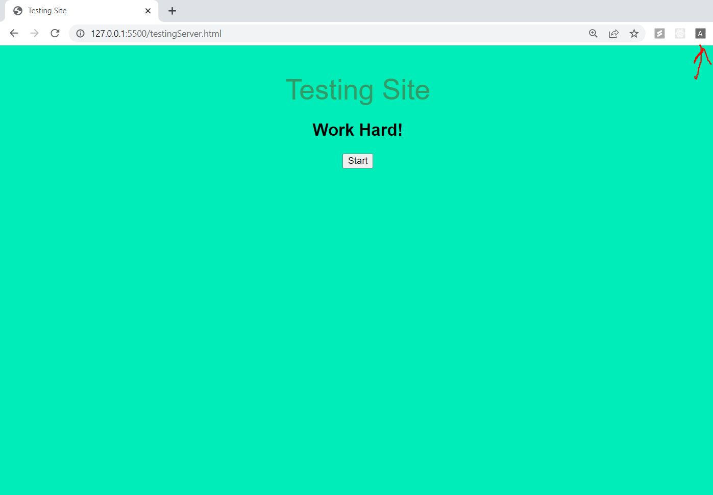
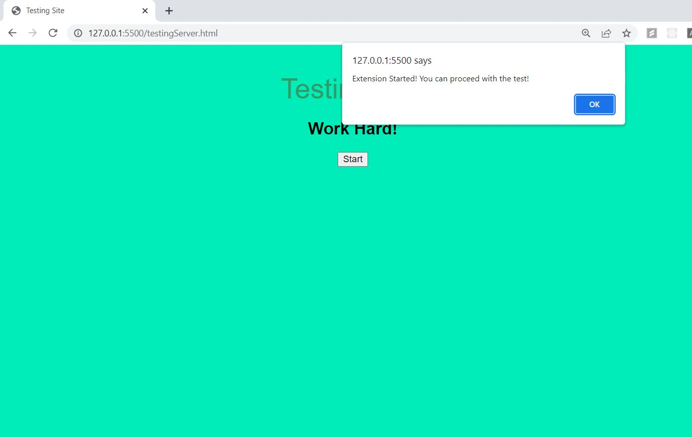
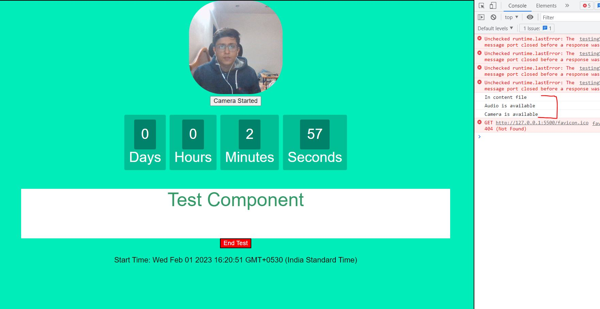
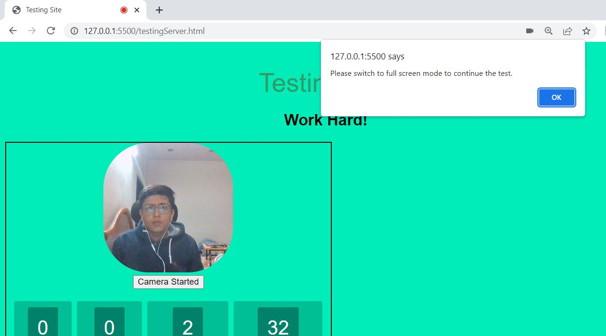
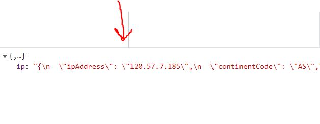
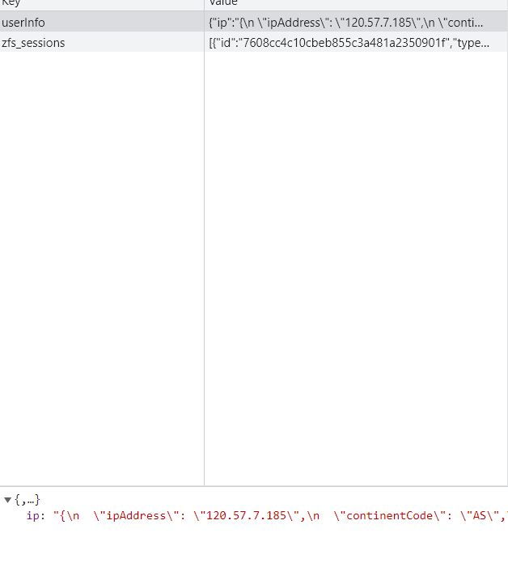

# eLITMUS Assignment - Gaurav Gulati 
### UserID - 4913358
 
A chrome extension that works on top of any assessment website, starting when the user opens a test page. Once the user clicks the &quot;end test&quot; button, the chrome extension should be disabled and the browser should return to its normal state. The extension should have basic features such as preventing browser  navigation, keeping the browser window in full mode while the user is taking the test, and disabling the user
from manually closing the browser.

 

 

### Feature Checklist

- [x] Extension should work only in selected url.
- [x] The browser should open in full screen.
- [x] Popup should be shown when someone switches tab.
- [x] More than one tab can't be opened.
- [x] User should not be able to close tab.
- [x] Perform requirements check.
- [x] Capture user related information.

